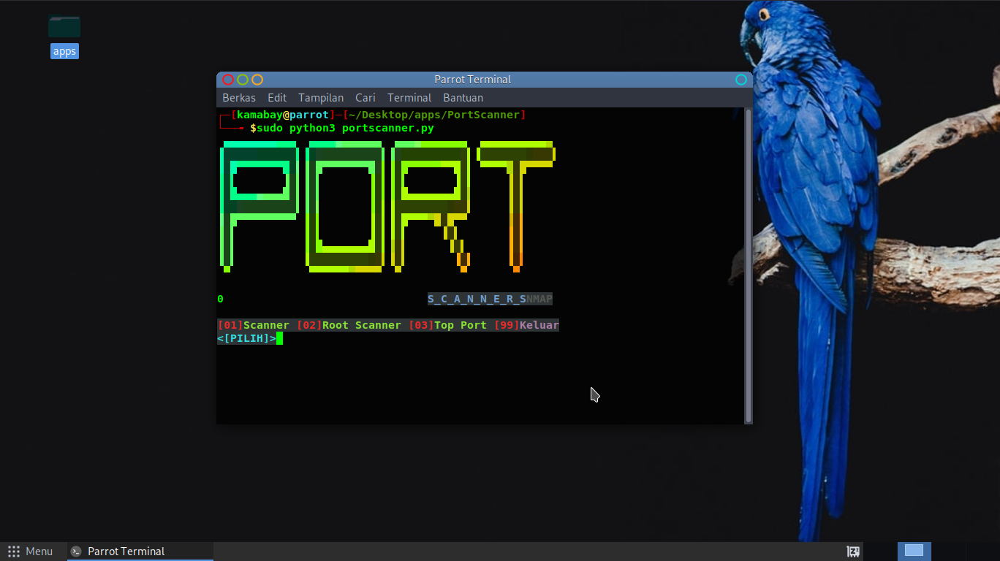

# portscanner
portscanner to look for open ports:
installation:
- git clone https://github.com/ExsoKamabay/portscanner.git
- apt install figlet -y && pip3 install lolcat && apt install nmap
- cd portscanner && python3 portscan.pyc

portscanner can be run on
- Parrot OS
- Kali
- Ubuntu
- Termux
